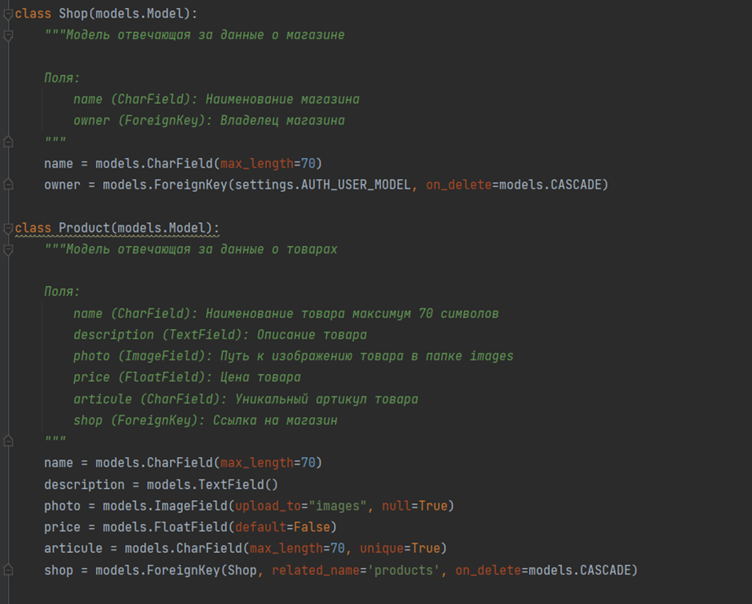
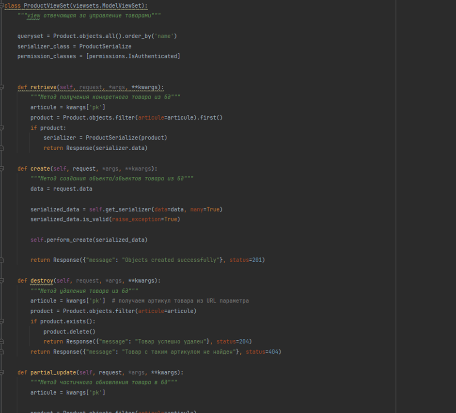
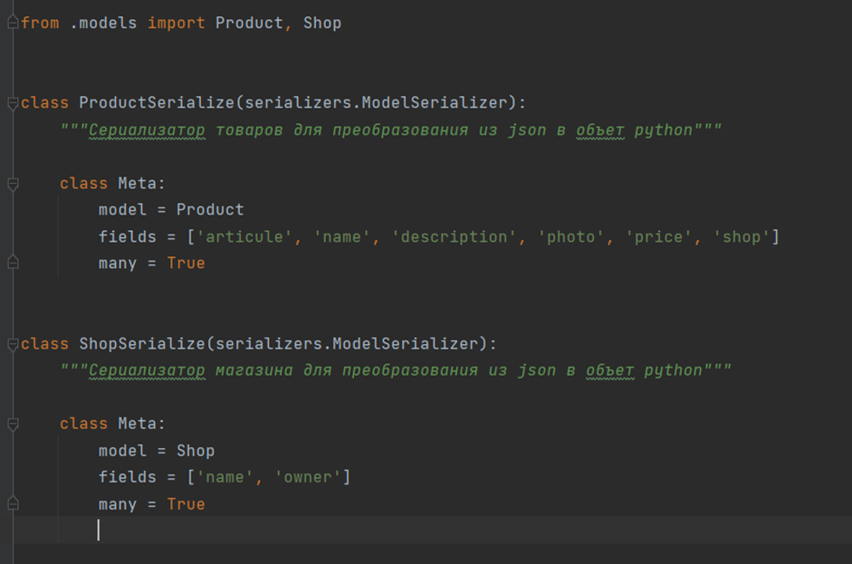
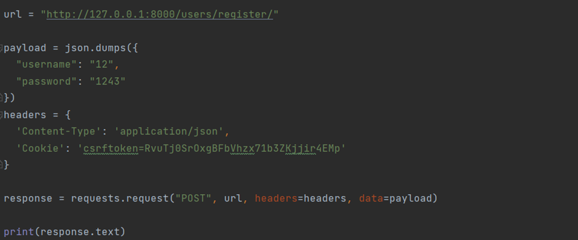
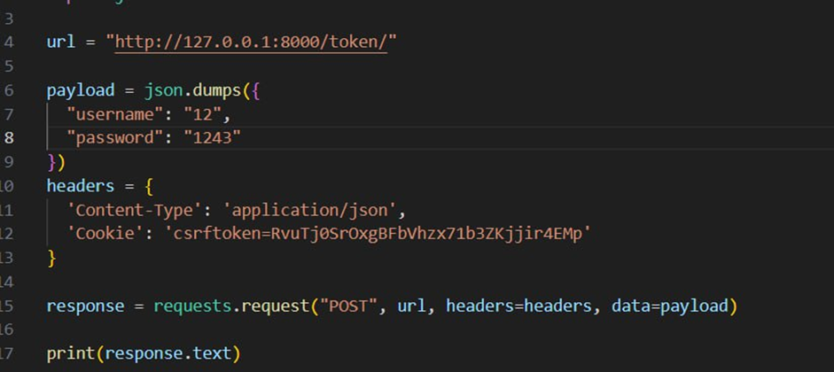
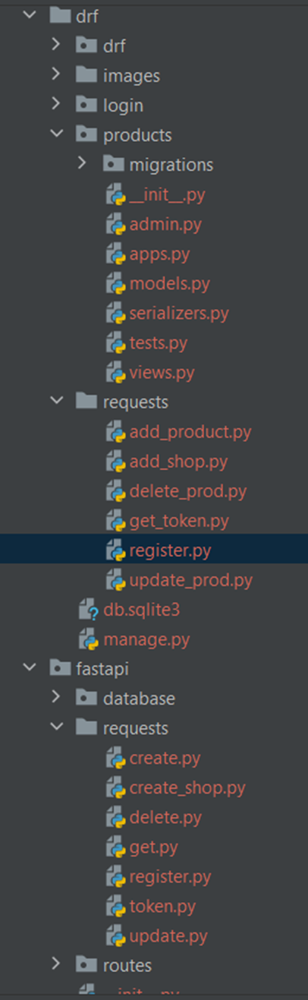

# Дипломная работа по теме:
## Сравнение различных подходов к реализации REST API: `Django Rest Framework`, `FastAPI` и `Flask-RESTful`: Разработать REST API с использованием Django Rest Framework, FastAPI и Flask-RESTful, провести их сравнение.

## Проект: REST API для маркетплейса 

**Автор Березин Дмитрий Валерьевич:**

## Обоснование выбора темы:

1. В современном мире любой сервис, который хочет масштабироваться и захватить “новую” целевую аудиторию, например в виде разработчиков ПО и крупных компаний, которые не готовы мириться с базовым функционалом клиентской части приложения, а стремятся автоматизировать работу интегрируя в свою экосистему все больше и больше возможностей требуют разработки своего REST API.

2. Потребности рынка: веб-разработчики, а также разработчики REST API пользуются растущим спросом т.к. почти любая крупная компания разрабатывает API своего сервиса, будь то открытое или закрытое, потому что: нет в интернете - нет в бизнесе. 

3. Практическая значимость: Работа над API позволит серьезно прокачать навыки веб-разработки “с другой стороны” не загружая себя изучением дополнительных языков по типу: HTML, CSS, JS и их специфических фреймворков.

4. Личный интерес и потенциальные перспективы: лично мне очень интересно поработать по обе стороны разработки веб-приложений. Кроме того, такие навыки востребованы на рынке труда, что открывает перспективы для карьерного роста и развития.

Таким образом, выбор проекта `REST API` для маркетплейса" обусловлен ее актуальностью, потребностями рынка, практической значимостью и личным интересом, что делает эту тему подходящей для проведения дипломной работы.

## Определение цели и задач исследования:

### 1. Цель исследования: написать `REST API` для маркетплейса, а также сравнить фреймворки для его написания

Задачи исследования:

1. Обзор фреймворков для разработки REST API

2. Разработка сценариев сравнения: определить критерии сравнения и сформировать набор данных для первичной проверки.

3. Создание платформы и проведение тестирования: реализовать REST API сервиса для маркетплейса в разных вариациях технологий, и провести их тестирование.

4. Написание дипломной работы: составить дипломную работу, включающую в себя введение, обзор литературы, методологию и результаты исследования, анализ результатов, выводы и рекомендации.

Цели и задачи исследования направлены на получение практических результатов, которые позволят сформировать рейтинг технологий для написания REST API.

### 2. Основные понятия и определения

Обзор основных понятий в сервисе REST API для маркетплейса:

1. Фреймворк (Framework): Программная платформа, которая предоставляет готовые компоненты и инструменты для разработки приложений. В контексте REST API часто используются Django Rest Framework, FastAPI и Flask-RESTful.

2. REST (Representational State Transfer) API — это архитектурный стиль для построения веб-сервисов, основанный на использовании HTTP-протокола для обмена данными между клиентом и сервером.

3. Веб-приложение (Web Application): Программное приложение, которое работает на веб-сервере и доступно через браузер.

4. СУБД (Система Управления Базами Данных) — это программное обеспечение, предназначенное для создания, управления и хранения баз данных.

5. Данные — это любая информация, представленная в формализованном виде, пригодная для хранения, передачи, обработки и интерпретации человеком или автоматизированной системой. В контексте нашего проекта данные представляют собой информацию о товарах маркетплейса 

6. Токен пользователя (или авторизационный токен) — это уникальная, аутентифицированная строка, представляющая информацию о пользователе, которая используется для его идентификации и авторизации при взаимодействии с API.

### 3. Методы и подходы к разработке

Архитектура веб-приложения

1. Django REST Framework:
   - Использование моделей Django для представления сущностей (Product, Store, User, etc.)
   - Реализация ViewSets и Serializers для обработки HTTP-запросов и представления данных
   - Применение аутентификации и авторизации, например, JWT-токены
   - Настройка маршрутизации с помощью DefaultRouter
   - Использование Django ORM для работы с базой данных

2. FastAPI:
   - Определение Pydantic-моделей для представления сущностей
   - Реализация CRUD-операций с использованием FastAPI-маршрутов
   - Использование зависимостей (Depends) для управления аутентификацией и авторизацией
   - Интеграция с СУБД, например, SQLAlchemy или Tortoise ORM
   - Применение Starlette и Pydantic для построения и валидации запросов/ответов

3. Flask-RESTful:
   - Определение ресурсов (Resource) для обработки HTTP-методов
   - Использование Flask-RESTful для маршрутизации и сериализации
   - Реализация аутентификации и авторизации, например, с использованием Flask-JWT-Extended
   - Интеграция с СУБД, например, SQLAlchemy
   - Применение Marshmallow для сериализации и валидации данных

### 4. Архитектура приложения:

1. Модели:
   - `Product`: name, description, photo, price, article, shop
   - `Shop`: name, owner

2. Эндпоинты:
   - POST /products/{article}/: Обновление информации о продукте по артикулу
   - POST /users/register/: Регистрация пользователя
   - POST /products/: Добавление одного товара
   - POST /token/: Получение токена
   - DELETE /products/{article}/: Удаление товара по артикулу
   - POST /shops/: привязка магазина к пользователю
   - PATCH /products/{article}/: Изменение информации о товаре по артикулу

3. Базовая структура:
   - Уровень моделей (модели Django, Pydantic или SQLAlchemy)
   - Уровень сервисов (бизнес-логика)
   - Уровень контроллеров/представлений (обработка HTTP-запросов)
   - Уровень маршрутизации (определение URL-адресов и HTTP-методов)
   - Уровень аутентификации и авторизации (JWT, Flask-JWT-Extended, Depends)
   - Уровень взаимодействия с базой данных (Django ORM, SQLAlchemy, Tortoise ORM)

Реализация данного приложения в трех вариантах (Django REST Framework, FastAPI и Flask-RESTful) позволит нам провести сравнительный анализ и выявить сильные и слабые стороны каждого подхода.

**Особенности:**

Подходит для небольших и средних проектов, где требуется большая гибкость.

1. Django REST Framework:
   - Django REST Framework (DRF) — это мощный и гибкий набор инструментов для построения веб-API на основе Django.
   - Основные преимущества DRF:
     - Предоставляет готовые решения для CRUD-операций, сериализации, аутентификации и авторизации.
     - Поддержка различных форматов данных (JSON, XML, etc.).
     - Встроенная документация API (Browsable API и Swagger).
     - Расширяемость за счет большого сообщества разработчиков.
     - Интеграция с Django ORM для работы с базой данных.
   - Недостатки:
     - Относительно высокая сложность настройки и конфигурирования.
     - Может быть избыточным для простых API-приложений.

2. FastAPI:
   - FastAPI - современный, быстрый (с высокой производительностью) веб-фреймворк для построения API с использованием Python 3.6+.
   - Основные преимущества FastAPI:
     - Высокая производительность, основанная на ASGI-серверах (Starlette и Uvicorn).
     - Простота и быстрота разработки благодаря использованию типизированных Pydantic-моделей.
     - Автоматическая генерация документации (OpenAPI/Swagger).
     - Встроенная поддержка асинхронности.
     - Гибкая система аутентификации и авторизации.
   - Недостатки:
     - Относительно молодой фреймворк, меньшее сообщество и экосистема.
     - Может потребоваться больше настройки для интеграции с реляционными базами данных.

3. Flask-RESTful:
   - Flask-RESTful — это расширение к популярному Python-фреймворку Flask, предназначенное для построения RESTful API.
   - Основные преимущества Flask-RESTful:
     - Простота и минималистичность, основанные на базовом Flask.
     - Гибкость и возможность кастомизации под конкретные задачи.
     - Легковесность, подходит для небольших и средних API-приложений.
     - Хорошая интеграция с сторонними библиотеками, такими как Flask-JWT-Extended для аутентификации.
   - Недостатки:
     - Меньше готовых решений, чем в DRF, приходится реализовывать больше вручную.
     - Меньшая производительность по сравнению с FastAPI.
     - Может потребоваться больше времени на настройку аутентификации и авторизации.

### 5. Проектирование приложения

Планирование и анализ требований

Выбор фреймворка и инструментов: Django Rest Framework, FastAPI

Определение структуры приложения: Разработка схемы архитектуры, включающей бэкенд, базу данных и интеграцию с внешними сервисами при необходимости.

Разработка прототипа

Реализация основного функционала: Создание базовой версии приложения с минимально необходимым функционалом для тестирования и демонстрации.

Разработка ключевого функционала

**Основные требования**

Реализация REST API со следующим функционалом:

Загрузка товаров в СУБД 

Получение товаров по артикулу

Изменение информации о товаре

Удаление товара/нескольких товаров по артикулу

Технические требования

Бэкенд: Python с использованием фреймворков Django Rest Framework, FastAPI

База данных: Использование базы данных SQlite для хранения данных о пользователях и истории загрузок.

### 6. Разработка в соответствии с созданной документацией

Планирование разработки

Разработка была разделена на несколько основных этапов: проектирование, реализация серверной логики, реализация функционала на трех фреймворках.

Технологии проекта:
1.	**Python 3.10**
2.	**Django Rest Framework**
3.	**FastAPI**

## Как реализован продукт?

 **Модели DRF:**

## VIEWS (представления) DRF (это не все. Если прикреплять все, много скриншотов получится)

## Serializers Django (сериализаторы)

## Ответ от сервера при регистрации пользователя + пример запроса

## Пример ответа от сервера при генерации токена + пример вызова метода

## Структура проекта:

## **Сравнение фреймворков Django Rest Framework, FastAP**

**Критерии сравнения:**
1. Поддержка асинхронности - способность обрабатывать асинхронные запросы
2. Уровень безопасности - возможности для реализации безопасности приложения
3. Сложность настройки - уровень сложности развертывания и настройки фреймворка
4. Скорость разработки - скорость и удобство создания API с использованием фреймворка
5. Интеграция с базами данных - легкость работы с различными типами баз данных

|          Критерий           |                                               DRF                                                |                                                   Fastapi                                                   |
|:---------------------------:|:------------------------------------------------------------------------------------------------:|:-----------------------------------------------------------------------------------------------------------:|
|   Поддержка асинхронности   |                      	•	 DRF не поддерживает асинхронную обработку запросов                   |        	•	FastAPI имеет встроенную поддержку асинхронности и позволяет создавать асинхронные API          |
|    Уровень безопасности     |   	•	DRF предлагает множество встроенных инструментов для обеспечения безопасности приложения  | 	•	FastAPI также предоставляет средства для обеспечения безопасности, уделяя особое внимание защите от атак | 
|     Сложность настройки     |            	•	DRF может быть сложен в настройке и требует определенных знаний Django        |        	•	FastAPI, благодаря своей простоте и удобству использования, позволяет быстро создавать API        |
|     Скорость разработки     |  	•	DRF имеет больше инструментов и функциональностей, что может замедлить скорость разработки|        	•	FastAPI, благодаря своей простоте и удобству использования, позволяет быстро создавать API        |
| Интеграция с базами данных  |              	•	DRF легко интегрируется с базами данных с использованием Django ORM           |    	•	FastAPI также обладает хорошей интеграцией с базами данных и предоставляет возможность выбора ORM     |

## Исходя из этого сравнения, можно заключить, что `FastAPI` предлагает более высокую производительность, легкость работы с асинхронностью и безопасностью, а также удобство настройки и создания API. В то время как `DRF` может быть более удобным для разработчиков, знакомых с `Django`, и предоставляет больше инструментов и функциональностей для расширения приложения.Выбор между ними будет зависеть от специфики проекта и требований к разрабатываемому `API`. В контексте моего проекта разработка на `DRF` велась около 6ти часов, а `FAST API` около 4х, что подтверждает вывод по данной работе.

